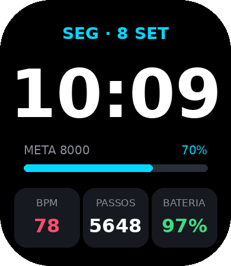

# Active2 Neon — watchface para Amazfit Active 2 (Square)

Mostrador digital personalizável feito em **Zepp OS** (API 3.0+), no tamanho da tela do
Active 2 Square: **390 × 450**, cantos com raio de 86 px.



Mostra:
- Dia da semana e data em português
- Hora grande (segue o formato 12h/24h do relógio)
- Barra de progresso da meta de passos
- Batimento (BPM), passos e bateria (a bateria fica laranja abaixo de 20%)
- Modo Always-On (AOD) simplificado: só hora e data, em cinza, para gastar menos bateria

## Estrutura

```
app.json                          configuração (nome, permissões, modelo de relógio)
watchface/active2-square/index.js código do mostrador; cores e textos ficam no topo
assets/active2-square/images/     imagens (preview.png = miniatura no app Zepp)
tools/make_preview.py             gera preview.png e mockup.png
```

## Personalizar

Abra `watchface/active2-square/index.js`. Tudo o que é fácil de mudar está no bloco `THEME`
no topo do arquivo:

```js
const THEME = {
  accent: 0x00d9ff, // cor de destaque: troque por 0xff6b00 (laranja), 0xa259ff (roxo)...
  time:   0xffffff, // cor da hora
  ...
}
```

- **Cores:** formato `0xRRGGBB`, o mesmo código hexadecimal de sites como o htmlcolorcodes.com.
- **Nomes dos dias/meses:** arrays `WEEKDAYS` e `MONTHS`.
- **Posições e tamanhos:** cada widget tem `x`, `y`, `w`, `h` em pixels da tela de 390 × 450.
- **Imagem de fundo:** coloque um PNG de 390 × 450 em `assets/active2-square/images/bg.png` e
  troque o `FILL_RECT` de fundo em `build()` por
  `createWidget(widget.IMG, { x: 0, y: 0, src: 'images/bg.png' })`.

Depois de mudar o layout, rode `python tools/make_preview.py` (precisa do `pip install pillow`)
para atualizar a miniatura. As cores desse script são uma cópia das do `index.js`.

## Instalar no relógio

Você precisa de um computador com Node.js e do app Zepp no celular.

1. Instale o CLI oficial da Zepp:
   ```bash
   npm i -g @zeppos/zeus-cli
   ```
2. Ative o **modo desenvolvedor** no app Zepp: *Perfil → Configurações → Sobre*, toque 7 vezes
   no logo do Zepp. Vai aparecer a opção *Modo desenvolvedor*.
3. Crie uma conta de desenvolvedor em <https://console.zepp.com> (é grátis, usa a mesma conta
   do app Zepp) e faça login no CLI:
   ```bash
   zeus login
   ```
4. Dentro desta pasta, gere o QR code e escolha **Amazfit Active 2 (Square)** na lista:
   ```bash
   cd active2-square-face
   zeus preview
   ```
5. No app Zepp: *Perfil → Configurações → Modo desenvolvedor → Escanear*, aponte para o QR
   code. O mostrador é instalado no relógio (o Bluetooth precisa estar ligado).

Para testar sem o relógio, dá para usar o simulador da Zepp
(<https://docs.zepp.com/docs/guides/tools/simulator/>) com `zeus dev`.

Para só gerar o pacote `.zab` (fica em `dist/`): `zeus build`.

### Sobre o `appId`

O `appId` em `app.json` (`1000001`) é provisório. Se quiser publicar na loja do Zepp,
crie o projeto no console de desenvolvedor e substitua pelo ID que ele gerar. Para uso pessoal
via `zeus preview` isso não é necessário, mas se o preview reclamar do ID, use o do console.

## Referências

- Lista de dispositivos Zepp OS (resolução, deviceSource): <https://docs.zepp.com/docs/reference/related-resources/device-list/>
- Sensores (`Time`, `Step`, `HeartRate`, `Battery`): <https://docs.zepp.com/docs/reference/device-app-api/newAPI/sensor/Time/>
- Exemplos oficiais: <https://github.com/zepp-health/zeppos-samples>
